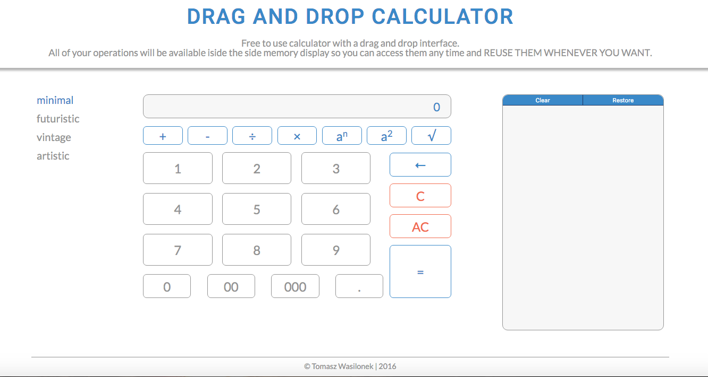

# Drag and Drop Calculator
===========================
In order to open the project, download all the files to your computer and open "index.html" in your browser. 
Or you can simply [click this link](http://twasilonek.github.io/DragDropCalculator/) to open the project on github pages.

## About
The Drag and Drop Calculator is a project I did for the final workshop at the Front-End Web Developer Bootcamp in Coder's Lab school in Warsaw. The ida was to create a normal calculator that has a memory display and allows reusing all elements from previous operations with a simple drag-and-drop action. Additionally I wanted to create 4 different graphic styles that can be used interchangeably without affecting how the calculator works.

  
## The current working version:
The current version is labelled "1.0" and features:
  * A fully working calculator performing basic mathematical operations;
  * A Memory Display that allows interaction with the memorized operations:
    * Selecting elements of previous operations;
    * Drag and drop actions to reuse those elements in the current operation (I'm using the standard HTML5 Drag and Drop API);
    * Deleting an operation from the Memory Display;
    * Deleting all operations at once from the Memory Display;
    * Restoring all cleared operations;
  * The "minimal" design with full responsivness for desktop and mobile screens (in portrait mode).

The applicaiton is fully working and performs all the main tasks it was designed to do. However there are additional elements and "nice to have" features that I plan to add soon.

## Features that will be available in the near future:
  * Adjusting the "minimal" layout to landscape mode on some mobile devices;
  * A complete redesing of the layout for handheld devices like smartphones and small tablets;
  * Drag and drop functionality for mobile devices (the HTML5 Drag and Drop API currently is not compatible with them);
  * Three additional graphic styles - Futuristic/sf, Vintage and Artistic (the navigation menu for them is already created but the links are toggled off at the moment);

    